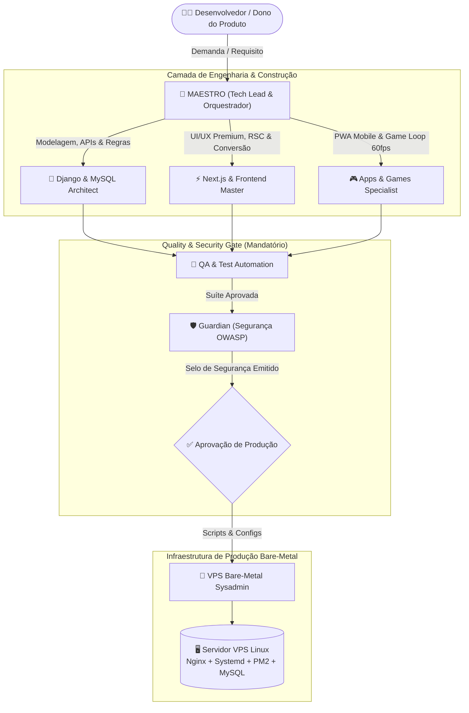

# 💎 MANUAL SUPREMO DO ECOSSISTEMA DE AGENTES: MAESTRO & ESQUADRÃO FULL STACK

> **Padrão de Engenharia**: Nível Vale do Silício  
> **Especialidade**: SaaS Multi-tenant, E-commerce de Alto Desempenho, Landing Pages de Alta Conversão, PWAs e Jogos Web  
> **Stack Central**: Python (Django / Ninja / DRF) • React.js / Next.js • MySQL 8.x Nativo  
> **Garantias Inegociáveis**: Selo de Segurança Contínuo (OWASP Top 10), Cobertura Rigorosa de Testes e Hospedagem em VPS Bare-Metal (100% sem Docker)

---

## 📑 ÍNDICE GERAL

1. [Visão Geral & Topologia da Inteligência](#1-visão-geral--topologia-da-inteligência)
2. [O Agente Regente: MAESTRO (Orquestrador & Tech Lead)](#2-o-agente-regente-maestro)
3. [Dossiê dos 6 Subagentes Especialistas](#3-dossiê-dos-6-subagentes-especialistas)
   - [3.1 Django & MySQL Architect](#31-django--mysql-architect)
   - [3.2 Next.js & Frontend Master](#32-nextjs--frontend-master)
   - [3.3 Apps & Games Specialist](#33-apps--games-specialist)
   - [3.4 QA & Test Automation Specialist](#34-qa--test-automation-specialist)
   - [3.5 Guardian (Security & Compliance)](#35-guardian-security--compliance)
   - [3.6 VPS Bare-Metal Sysadmin (Zero Docker)](#36-vps-bare-metal-sysadmin-zero-docker)
4. [O Protocolo do "Selo de Segurança"](#4-o-protocolo-do-selo-de-segurança)
5. [Guia Operacional da VPS Linux (Zero Docker)](#5-guia-operacional-da-vps-linux-zero-docker)
6. [Playbook de Prompts Prontos por Tipo de Projeto](#6-playbook-de-prompts-prontos-por-tipo-de-projeto)

---

## 1. VISÃO GERAL & TOPOLOGIA DA INTELIGÊNCIA

O ecossistema opera como uma software house autônoma de alta performance. Você não precisa instruir cada detalhe de arquitetura; o **Maestro** lidera o planejamento e ativa os especialistas na sequência exata de dependências.



---

## 2. O AGENTE REGENTE: MAESTRO

O **MAESTRO** é o cérebro que comanda todo o fluxo.

### Como Acionar o Maestro:
Basta conversar naturalmente informando sua necessidade:
- *"Maestro, preciso de um SaaS de agendamento multi-empresa com pagamentos PIX/Cartão e envio de WhatsApp."*
- *"Maestro, vamos criar uma Landing Page ultra-premium para um produto de IA com formulário de lista de espera."*

### O Ciclo de Execução do Maestro:
1. **Desconstrução Arquitetural**: Mapeia modelos de dados, endpoints, componentes de interface e regras de negócio.
2. **Delegação Paralela**: Distribui a codificação entre Django/MySQL e Next.js sem divergência de schemas.
3. **Ponto de Controle de Testes**: Aciona o QA para escrever e rodar testes de integração e unitários.
4. **Inspeção de Segurança**: Aciona o Guardian para auditar o código e atestar o Selo de Segurança.
5. **Entrega de Deploy**: Aciona o VPS Sysadmin para entregar comandos prontos e configurações de servidor.

---

## 3. DOSSIÊ DOS 6 SUBAGENTES ESPECIALISTAS

---

### 3.1 DJANGO & MYSQL ARCHITECT
*Especialista em Banco de Dados Relacional, APIs de Baixa Latência e Arquitetura Multi-Tenant.*

> **Padrões Inegociáveis deste Subagente:**
> - **Zero N+1 Queries**: Todo relacionamento usa `select_related` ou `prefetch_related`.
> - **Transações Atômicas**: Checkout, transferências e criação de tenants rodam sob `@transaction.atomic`.
> - **Concorrência Segura**: Operações com estoque ou limites usam `select_for_update()`.
> - **Valores Monetários**: Sempre `DecimalField(max_digits=12, decimal_places=2)`. NUNCA `FloatField`.

#### Exemplo de Padrão Multi-Tenant Django:
```python
from django.db import models
from django.db import transaction

class Tenant(models.Model):
    name = models.CharField(max_length=150)
    slug = models.SlugField(unique=True, db_index=True)
    is_active = models.BooleanField(default=True)
    created_at = models.DateTimeField(auto_now_add=True)

class TenantAwareModel(models.Model):
    tenant = models.ForeignKey(Tenant, on_delete=models.CASCADE, db_index=True)
    created_at = models.DateTimeField(auto_now_add=True, db_index=True)

    class Meta:
        abstract = True

class Order(TenantAwareModel):
    total = models.DecimalField(max_digits=12, decimal_places=2)
    status = models.CharField(max_length=20, default='PENDING', db_index=True)

    class Meta:
        indexes = [
            models.Index(fields=['tenant', 'status', 'created_at']),
        ]
```

---

### 3.2 NEXT.JS & FRONTEND MASTER
*Mestre em React Server Components, Design System de Alto Nível e Conversão.*

> **Padrões Visuais Deste Subagente:**
> - Paleta **Obsidian & Deep Slate** (`#0B0F17`, `#111827`) com acentos em Índigo Elétrico (`#6366F1`) e Esmeralda Neon (`#10B981`).
> - Tipografias modernas do Google Fonts (*Plus Jakarta Sans*, *Inter*, *Outfit*).
> - Efeitos de Glassmorphism elegante (`backdrop-filter: blur(12px)` e bordas sutis `rgba(255,255,255,0.08)`).
> - Micro-animações em botões, skeletons em carregamento e feedback visual instantâneo.

---

### 3.3 APPS & GAMES SPECIALIST
*Engenharia de Progressive Web Apps e Mecânicas de Jogos/Gamificação a 60 FPS.*

> **Diretrizes Técnicas:**
> - **PWA**: Service Worker com estratégia Cache-First para assets estáticos e suporte total a Safe-Areas móveis (`env(safe-area-inset-top)`).
> - **Jogos Web (Canvas/PixiJS/Three.js)**: Game loop com `requestAnimationFrame` usando delta time (`dt`) rigoroso e *Object Pooling* para projéteis/efeitos sem travas de Garbage Collection.
> - **Gamificação para SaaS/E-commerce**: Roletas interativas de cupons, barras de XP, streaks de uso contínuo e rankings.

---

### 3.4 QA & TEST AUTOMATION SPECIALIST
*Engenheiro de Confiabilidade e Cobertura de Código.*

> **Metas de Qualidade:**
> - Cobertura mínima de **85%** nos módulos de autenticação, pagamentos, faturamento e multi-tenancy.
> - Todos os gateways externos (Stripe, Mercado Pago, WhatsApp, Correios) são mockados nos testes de CI para evitar chamadas de rede.

#### Comandos Rápidos de Teste:
```bash
# Testes do Backend com Pytest
pytest --maxfail=1 -q

# Testes E2E do Frontend com Playwright
npx playwright test --project=chromium
```

---

### 3.5 GUARDIAN (SECURITY & COMPLIANCE)
*Auditor de Defesa em Profundidade e Emissor do Selo de Segurança.*

> **Regras de Bloqueio de Deploy:**
> - Nenhuma chave ou senha no código limpo.
> - Nenhum `DEBUG = True` em ambiente público.
> - Nenhum endpoint sem controle estrito de autorização de Tenant/Usuário (Prevenção de IDOR).
> - Cabeçalhos HSTS, CSP e X-Frame-Options devidamente aplicados no Nginx.

---

### 3.6 VPS BARE-METAL SYSADMIN (ZERO DOCKER)
*Sysadmin Linux para Máxima Performance Direta na CPU e Memória.*

> **Por que 100% Sem Docker?**
> - **Zero Overhead**: Toda a memória RAM e poder de processamento da VPS são dedicados diretamente ao MySQL, Gunicorn e Next.js.
> - **Comunicação Ultrarrápida**: Nginx e Django se comunicam via **Unix Socket** (`/run/gunicorn.sock`), sem latência de portas TCP de contêiner.
> - **Simplicidade de Manutenção**: Logs limpos no Systemd (`journalctl`), processos monitorados pelo PM2 e MySQL nativo com buffer pool otimizado.

---

## 4. O PROTOCOLO DO "SELO DE SEGURANÇA"

Ao finalizar qualquer funcionalidade crítica, o Guardian gera o relatório:

```
=======================================================================
               🛡️ CERTIFICAÇÃO OFICIAL: SELO DE SEGURANÇA
=======================================================================
[✓] OWASP A01 - Broken Access Control: Validado (Isolamento por Tenant)
[✓] OWASP A02 - Cryptographic Failures: Validado (Argon2 Hashing + HTTPS)
[✓] OWASP A03 - Injection: Validado (ORM Parametrizado, Zero Raw SQL)
[✓] OWASP A04 - Insecure Design: Validado (Rate Limiting Ativo)
[✓] OWASP A05 - Security Misconfiguration: Validado (Headers HSTS/CSP)
[✓] OWASP A07 - Auth Failures: Validado (JWT Seguro + Refresh Rotation)
-----------------------------------------------------------------------
STATUS FINAL: ✅ SELO DE SEGURANÇA CONCEDIDO PARA PRODUÇÃO
=======================================================================
```

---

## 5. GUIA OPERACIONAL DA VPS LINUX (ZERO DOCKER)

### Tabela de Portas e Serviços
| Serviço | Processo | Como Opera | Porta / Socket |
| :--- | :--- | :--- | :--- |
| **Nginx** | Reverse Proxy | Entrada principal da web | 80 (HTTP) e 443 (HTTPS) |
| **Next.js** | Node.js (PM2) | SSR e renderização de páginas | `127.0.0.1:3000` |
| **Django** | Gunicorn (Systemd) | API e Admin do Django | `unix:/run/gunicorn.sock` |
| **Celery** | Worker (Systemd) | Filas assíncronas | Conecta em Redis local |
| **MySQL** | MySQL Server nativo | Armazenamento persistente | `127.0.0.1:3306` (Local apenas) |

### Comandos de Gestão Diária no Terminal da VPS:
```bash
# Verificar status dos serviços
sudo systemctl status gunicorn.service
pm2 status
sudo systemctl status nginx
sudo systemctl status mysql

# Atualização de código com ZERO DOWNTIME (Deploy)
cd /var/www/meu-app
git pull origin main
source backend/venv/bin/activate
pip install -r backend/requirements.txt
python backend/manage.py migrate
sudo systemctl reload gunicorn

cd frontend
npm ci && npm run build
pm2 reload ecosystem.config.js --env production

# Visualizar logs em tempo real
sudo journalctl -u gunicorn.service -f
pm2 logs
sudo tail -f /var/log/nginx/error.log
```

---

## 6. PLAYBOOK DE PROMPTS PRONTOS

Copie e cole estes prompts para iniciar qualquer tarefa no Antigravity:

### 💼 Para Criar um Novo SaaS:
> *"Maestro, preciso criar o módulo de faturamento recorrente com planos (Mensal e Anual). O backend Django deve processar webhooks de pagamento de forma idempotente e salvar no MySQL com isolamento por Tenant. O frontend Next.js precisa de uma tabela de preços comparativa com toggle e badge de mais popular, além do checkout com validações. Gere os testes com pytest e a checagem do Selo de Segurança."*

### 🛍️ Para Criar um E-commerce de Alta Conversão:
> *"Maestro, lidere o desenvolvimento da página de produto com galeria de imagens interativa, seletor de variantes (cor/tamanho) e drawer lateral de carrinho de compras sem recarregar a página. No backend Django, garanta que o estoque seja debitado com controle de concorrência atômico no MySQL para impedir vendas duplicadas."*

### 🚀 Para Fazer Deploy na VPS:
> *"Subagente VPS, configure o deploy do meu novo projeto para o domínio `meudominio.com.br`. Entregue o arquivo do Nginx com SSL e cache estático, os arquivos de Systemd para o Gunicorn e o `ecosystem.config.js` para o Next.js no PM2, prontos para rodar no Ubuntu sem Docker."*

### 🛡️ Para Realizar uma Auditoria de Segurança:
> *"Guardian, execute uma varredura completa de segurança no código deste projeto. Verifique vazamento de variáveis de ambiente, validação de permissões de rota e vulnerabilidades OWASP Top 10, e emita o Relatório do Selo de Segurança."*
