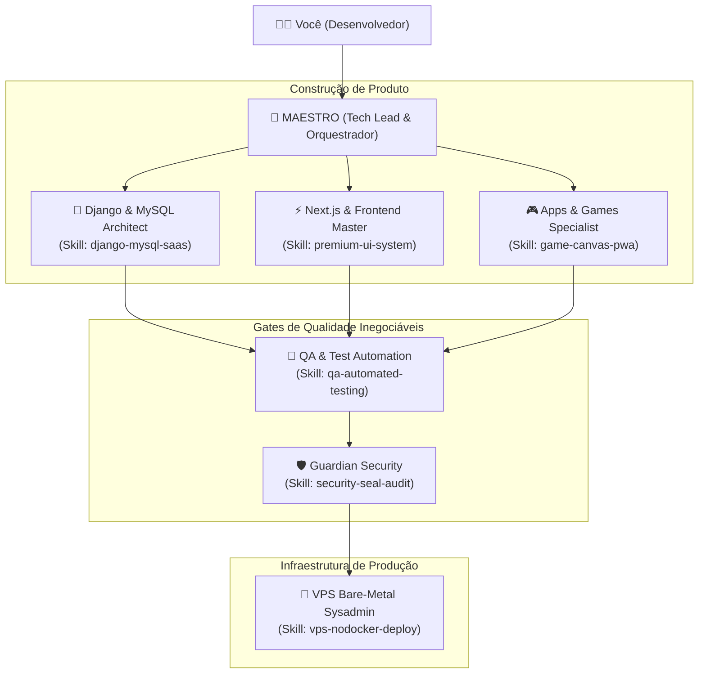

<div align="center">

# 👑 MAESTRO & FULL STACK AGENT ECOSYSTEM
### Ecossistema Autônomo de Agente Regente e 6 Subagentes para Antigravity AI

[](LICENSE)
[](#)
[](#)
[-f59e0b.svg)](#)
[](#)
[](CONTRIBUTING.md)

<p align="center">
  <b>Transforme o Antigravity em uma software house de nível Silicon Valley para SaaS, E-commerces, Landing Pages, Apps e Jogos.</b>
</p>

[Instalação Rápida](#-instalação-rápida-em-1-comando) •
[Arquitetura](#-arquitetura-do-ecossistema) •
[Subagentes](#-os-6-subagentes-especialistas) •
[Selo de Segurança](#-o-selo-de-segurança) •
[Deploy Bare-Metal](#-deploy-em-vps-bare-metal-zero-docker) •
[Documentação em PDF](#-documentação-premium-em-pdf)

</div>

---

## ⚡ INSTALAÇÃO RÁPIDA (EM 1 COMANDO)

Clone o repositório e rode o instalador global de acordo com o seu sistema operacional:

### No Windows (PowerShell):
```powershell
git clone https://github.com/gwpoliveira/antigravity-fullstack-maestro.git
cd antigravity-fullstack-maestro
.\install.ps1
```

### No Linux ou macOS (Bash):
```bash
git clone https://github.com/gwpoliveira/antigravity-fullstack-maestro.git
cd antigravity-fullstack-maestro
chmod +x install.sh && ./install.sh
```

> **Pronto!** O instalador registra o ecossistema no diretório global do Antigravity (`~/.gemini/config/`). A partir deste momento, o **Maestro** e todos os subagentes ficam disponíveis em **qualquer projeto ou pasta** que você abrir no seu computador.

---

## 🏛️ ARQUITETURA DO ECOSSISTEMA



---

## 👥 OS 6 SUBAGENTES & SKILLS ESPECIALIZADAS

| Subagente | Skill Oficial Vinculada | Especialidade Principal | Regras Mandatórias |
| :--- | :--- | :--- | :--- |
| **👑 Maestro** | `maestro-orchestrator` | Tech Lead & Orquestrador Geral | Decomposição técnica, protocolo de handoff e aprovação com duplo portão. |
| **🐍 Django & MySQL** | [`django-mysql-saas`](.agents/skills/django-mysql-saas) | Backend, ORM & Banco Relacional | Zero N+1 (`select_related`/`prefetch`), concorrência atômica e tipos estritos. |
| **⚡ Next.js & React** | [`premium-ui-system`](.agents/skills/premium-ui-system), [`nextjs-seo-master`](.agents/skills/nextjs-seo-master) | Frontend, UI/UX, SEO & Ranqueamento | Paleta Obsidian dark mode, Schema.org JSON-LD, sitemap e Core Web Vitals no topo do Google. |
| **🎮 Apps & Games** | [`game-canvas-pwa`](.agents/skills/game-canvas-pwa) | Mobile Híbrido/PWA & Web Games | PWA com cache offline, game loop com delta time a 60 FPS e streaks/gamificação. |
| **🧪 QA & Testes** | [`qa-automated-testing`](.agents/skills/qa-automated-testing) | Automação e Pirâmide de Testes | Suíte `pytest-django`, testes de componentes e Playwright E2E com mocks. |
| **🛡️ Guardian** | [`security-seal-audit`](.agents/skills/security-seal-audit) | Cibersegurança & Compliance | Auditoria contínua OWASP Top 10 e emissão formal do **Selo de Segurança**. |
| **🐧 VPS Sysadmin** | [`vps-nodocker-deploy`](.agents/skills/vps-nodocker-deploy) | DevOps Bare-Metal (Zero Docker) | Nginx via Unix Socket para Gunicorn, Next.js via PM2 e MySQL nativo no host. |

---

## 🛡️ O SELO DE SEGURANÇA

Nenhuma feature vai para produção sem passar pelo crivo do **Guardian**:
- [x] **Prevenção de SQLi**: ORM estritamente parametrizado, zero interpolação de strings.
- [x] **Prevenção de IDOR**: Isolamento obrigatório por Tenant e Usuário autenticado.
- [x] **Proteção de Segredos**: Proibição de credenciais em código limpo e `DEBUG=False`.
- [x] **Cabeçalhos Blindados**: HSTS, Content Security Policy, X-Frame-Options e SameSite.
- [x] **Rate Limiting**: Throttling em logins, cadastros e rotas de checkout.

---

## 🐧 DEPLOY EM VPS BARE-METAL (ZERO DOCKER)

Por que operar 100% sem Docker?
1. **Desempenho Bruto**: 100% da RAM e CPU dedicados aos processos do projeto, sem o overhead de virtualização.
2. **Latência Próxima de Zero**: Comunicação entre Nginx e Django via **Unix Socket** (`/run/gunicorn.sock`).
3. **Resiliência Nativa**: Daemons gerenciados pelo `systemd` e cluster Next.js mantido vivo pelo `PM2`.

O repositório inclui templates prontos na pasta `templates/`:
- `templates/nginx/app_production.conf`: Nginx com SSL, gzip, rate limiting e cache.
- `templates/systemd/gunicorn.service`: Daemon do Django via Unix Socket.
- `templates/systemd/celery.service`: Fila de tarefas assíncronas em segundo plano.
- `templates/pm2/ecosystem.config.js`: Gerenciamento do Next.js com reinício automático.
- `templates/mysql/my_performance.cnf`: Tuning de InnoDB e Slow Query Log.
- `templates/security/setup_vps_security.sh`: Script de 1 clique para UFW, Fail2ban e cron de backup do MySQL.

---

## 📄 DOCUMENTAÇÃO PREMIUM EM PDF

O projeto inclui um manual editorial completo formatado para impressão:
- **Arquivo PDF**: [`GUIA_PREMIUM_ECOSSISTEMA.pdf`](GUIA_PREMIUM_ECOSSISTEMA.pdf) (880 KB)
- **Portal Web Offline**: [`docs/index.html`](docs/index.html)

---

## 🤝 CONTRIBUIÇÕES

Contribuições da comunidade são muito bem-vindas! Veja o arquivo [CONTRIBUTING.md](CONTRIBUTING.md) para saber como sugerir novos subagentes, skills ou otimizações.

---

## 📝 LICENÇA

Distribuído sob a licença **MIT**. Veja o arquivo [LICENSE](LICENSE) para mais detalhes.
